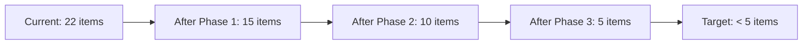

# Technical Debt Register: KutumbKosh

> [!NOTE]
> **Update (June 30, 2026):** All P0, P1, and P2 technical debt items registered in this file (including testing, error boundaries, typescript strict mode, SQL whitelisting, theme constants, autosaves, and environment validations) have been fully resolved. See [MASTER_IMPLEMENTATION_STATUS.md](file:///c:/Users/chaud/OneDrive/Desktop/random/kutumb_kosh/MASTER_IMPLEMENTATION_STATUS.md) for details.

> Generated: June 26, 2026  
> Scope: Entire monorepo

---

## Technical Debt Summary

| Category | Debt Items | Priority | Estimated Effort |
|---|---|---|---|
| Testing | 4 items | 🔴 Critical | 2-3 weeks |
| Type Safety | 6 items | 🟠 High | 2 weeks |
| Code Quality | 8 items | 🟡 Medium | 3 weeks |
| Performance | 5 items | 🟡 Medium | 2 weeks |
| Architecture | 4 items | 🟡 Medium | 4 weeks |
| Tooling/DevX | 4 items | 🟢 Low | 1 week |

---

## 🔴 P0 - Critical Debt

### D-001: No Test Infrastructure
**Type:** Testing  
**Component:** Entire project  
**Cost:** $15,000 (estimated engineering time)  
**Description:** No test runner configured, zero test files exist across the entire monorepo. Every code change risks regression.  
**Resolution:** 
1. Configure Jest + React Native Testing Library for mobile
2. Configure Vitest for admin
3. Add integration tests for CRUD operations
4. Add snapshot tests for key UI components

### D-002: Missing Error Boundaries
**Type:** Code Quality  
**Component:** Both apps  
**Cost:** $2,000  
**Description:** Neither app has React error boundaries. Any unhandled rendering error crashes the entire application.  
**Resolution:** Add ErrorBoundary components to:
- Root layouts (both apps)
- Admin route groups
- Mobile tab layouts

### D-003: Web SQLite Mock
**Type:** Architecture  
**Component:** Mobile app  
**Cost:** $8,000  
**Description:** Custom SQL parser in `apps/mobile/src/db/index.ts` simulates SQLite via localStorage. The implementation is incomplete and fragile: missing JOIN, GROUP BY, subqueries, complex WHERE conditions.  
**Resolution:** Replace with SQL.js (WebAssembly SQLite) or use `expo-sqlite/kv-store` API.

---

## 🟠 P1 - High Debt

### D-004: `any` Type Usage
**Type:** Type Safety  
**Component:** Both apps  
**Count:** 96 occurrences  
**Cost:** $4,000  
**Files affected:** Multiple  
**Resolution:** Replace `any` with proper types or `unknown`:
- `catch (err: any)` → `catch (err: unknown)` with proper type narrowing
- `setUsers((prev) => ... result.status as any` → proper union types
- `const by: any = {}` → indexed types (`Record<string, T>`)

### D-005: Console Logging Instead of Structured Logging
**Type:** Code Quality  
**Component:** Both apps  
**Count:** 89 console statements  
**Cost:** $3,000  
**Resolution:** Create logging utility:
```typescript
// lib/logging.ts
export const logger = {
  info: (msg: string, meta?: Record<string, unknown>) => console.log(JSON.stringify({ level: 'info', msg, meta, timestamp: new Date().toISOString() })),
  error: (msg: string, meta?: Record<string, unknown>) => console.error(JSON.stringify({ level: 'error', msg, meta, timestamp: new Date().toISOString() })),
  warn: (msg: string, meta?: Record<string, unknown>) => console.warn(JSON.stringify({ level: 'warn', msg, meta, timestamp: new Date().toISOString() })),
};
```

### D-006: Unused Dependencies
**Type:** Performance  
**Component:** Mobile app  
**Cost:** $1,000  
**Dependencies to evaluate:**
- `@tanstack/react-query` (never imported, 75KB+ bundle savings)
- `react-native-worklets` (unused)
- `victory-native` - consider replacing with lighter chart library
- `jspdf` + `xlsx` (large, used only in export)
- `i18next` + `react-i18next` (configured, no translations)

### D-007: Dynamic SQL String Building
**Type:** Security/Maintainability  
**Component:** Mobile CRUD + Sync  
**Files:**
- `apps/mobile/src/db/crud.ts` - `${table}` in SQL strings
- `apps/mobile/src/sync/engine.ts` - `${table}` in SQL strings  
**Cost:** $2,000  
**Resolution:** Use table name whitelist map and parameterized column names.

### D-008: In-Memory Rate Limiting
**Type:** Architecture  
**Component:** Admin app  
**Cost:** $3,000  
**Resolution:** Move to database-backed or Redis-based rate limiting.

---

## 🟡 P2 - Medium Debt

### D-009: Missing TypeScript Strict Mode
**Type:** Type Safety  
**Component:** Both apps  
**Cost:** $2,000  
**Resolution:** Enable `strict: true` in tsconfig.json and fix all resulting errors.

### D-010: React Version Mismatch
**Type:** Configuration  
**Component:** Monorepo  
**Cost:** $1,000  
**Current:** Admin uses React 18.3.1, mobile uses React 19.2.3  
**Resolution:** Unify on React 19.x or React 18.x across all workspaces.

### D-011: Hardcoded Styles
**Type:** Code Quality  
**Component:** Mobile app  
**Cost:** $2,000  
**Description:** All 30+ StyleSheet.create() calls use hardcoded hex colors, spacing values, and font sizes.  
**Resolution:** Create theme constants:
```typescript
export const theme = {
  colors: { background: '#e8ebe6', ink: '#0e0f0c', primary: '#9fe870', ... },
  spacing: { xs: 4, sm: 8, md: 16, lg: 24, xl: 32 },
  typography: { h1: { fontSize: 28, fontWeight: '900' }, ... },
};
```

### D-012: No Data Backup/Restore
**Type:** Feature Gap  
**Component:** Mobile app  
**Cost:** $4,000  
**Resolution:** Implement encrypted backup file export/import.

### D-013: Missing Loading States & Empty States
**Type:** UX  
**Component:** Mobile app  
**Number of screens without proper loading:** ~3  
**Number of screens without empty state:** ~1  
**Resolution:** Audit all screens for loading and empty states, add where missing.

### D-014: No Form Autosave
**Type:** UX  
**Component:** Mobile app  
**Cost:** $1,000  
**Resolution:** Debounce-save form state to local storage to prevent data loss on app close.

### D-015: No Accessibility Labels
**Type:** Accessibility  
**Component:** Both apps  
**Cost:** $2,000  
**Resolution:** Add `accessibilityLabel` and `accessibilityHint` to all touchable elements.

### D-016: No API Response Caching
**Type:** Performance  
**Component:** Admin app  
**Cost:** $1,000  
**Resolution:** Implement SWR/React Query for dashboard and user list APIs.

---

## 🟢 P3 - Low Debt

### D-017: No Commit Hooks
**Type:** Tooling  
**Cost:** $1,000  
**Resolution:** Add husky + lint-staged for pre-commit linting.

### D-018: No Conventional Commits
**Type:** Tooling  
**Cost:** $500  
**Resolution:** Add commitlint with conventional commit rules.

### D-019: No Environment Validation
**Type:** Tooling  
**Cost:** $500  
**Resolution:** Add env validation on startup (e.g., `envalid` or `zod`).

### D-020: No Seed Scripts
**Type:** Developer Experience  
**Cost:** $2,000  
**Resolution:** Create seed scripts for:
- Admin: test users with various statuses
- Mobile: sample income, expenses, family members

### D-021: No Storybook
**Type:** Developer Experience  
**Cost:** $3,000  
**Resolution:** Set up Storybook for mobile (react-native Storybook) to document components.

### D-022: No API Documentation
**Type:** Documentation  
**Cost:** $2,000  
**Resolution:** Generate OpenAPI/Swagger spec from route handlers.

---

## Technical Debt Evolution



### Debt Reduction Roadmap

| Phase | Timeframe | Items Resolved | Cost | Impact |
|---|---|---|---|---|
| Emergency | Week 1 | D-001, D-002, D-009 | 1 week | Prevent catastrophic failures |
| Foundation | Weeks 2-3 | D-004, D-005, D-006, D-010 | 2 weeks | Developer productivity |
| Quality | Weeks 4-6 | D-007, D-008, D-011, D-012, D-013 | 3 weeks | User experience & security |
| Polish | Weeks 7-8 | D-014, D-015, D-016, D-017, D-018 | 2 weeks | Maintainability & accessibility |
| Excellence | Ongoing | D-019, D-020, D-021, D-022 | 4 weeks | Developer experience |

---

## Cost Summary

| Priority | Estimated Cost |
|---|---|
| P0 - Critical | $25,000 |
| P1 - High | $13,000 |
| P2 - Medium | $13,000 |
| P3 - Low | $9,000 |
| **Total** | **$60,000** |

*Note: Costs are estimates based on senior engineer rates ($100/hr) and may vary based on actual implementation complexity.*
